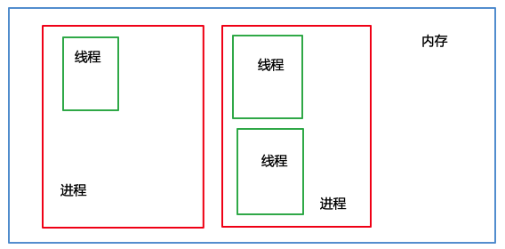
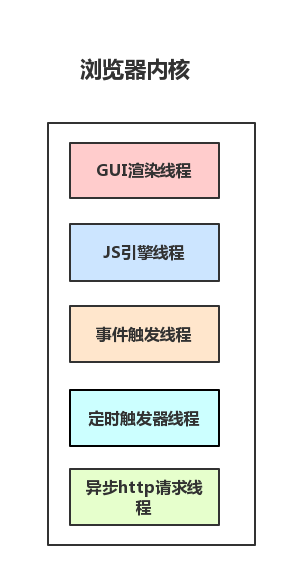
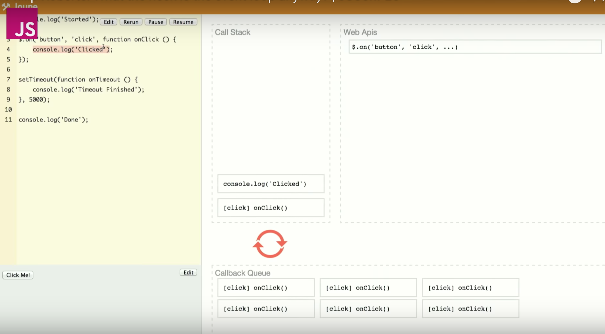
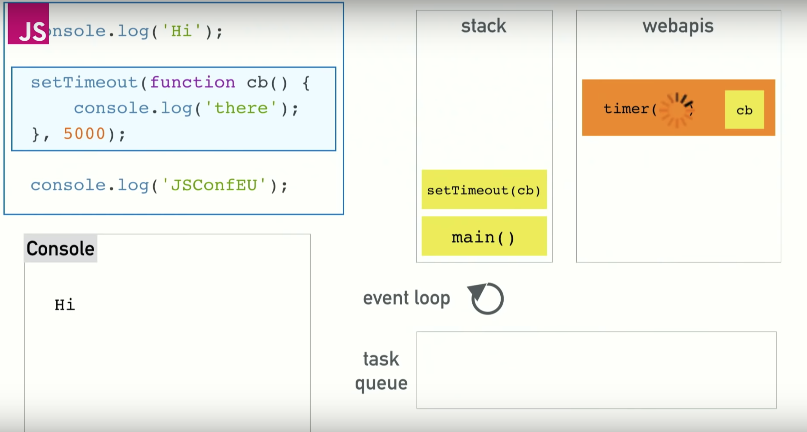
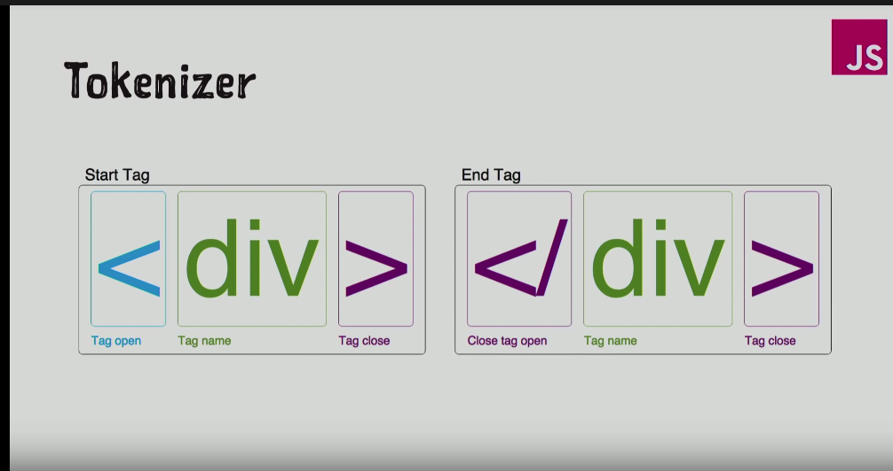
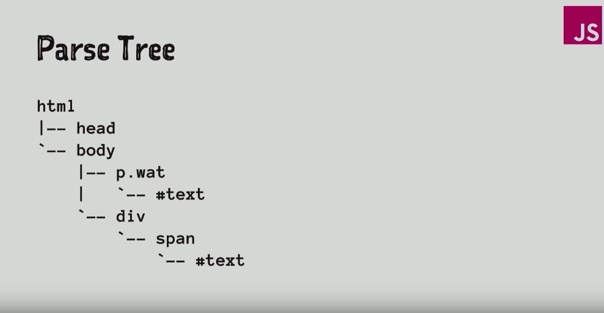
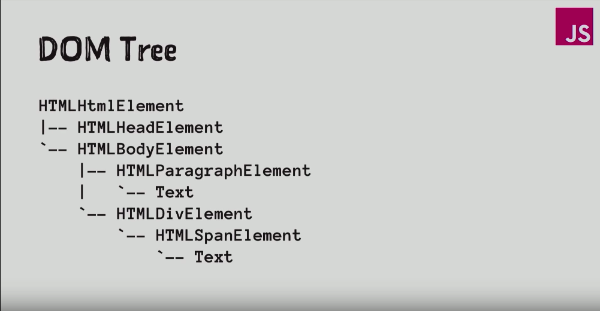

今天和大家聊一聊浏览器 并且 说一说`浏览器`和`JS引擎线程`之间的关系

## 进程与线程

## 单线程的JS引擎

说到nodeJS就会说到 `单线程,异步,事件驱动`, 这里强调JS的单线程指运行程序指的是JS引擎同一时间只能执行一个任务,其他的JS代码需要在列队中等待执行

这个稍后再说

## 浏览器

平时所说的JS引擎运行JS程序单线程是否就代表浏览器它就是单线程的呢?

NO

浏览器不仅不是单线程,她还是`多进程`的,浏览器之所以能运行,是因为系统给它的进程分配了资源(cpu, 内存),类似于Chrome这样的浏览器,每打开一个Tab页面,就多开了一个进程,甚至包括你安装的浏览器插件都是开了新的进程

讲几个主要的进程

	1. 浏览器的主进程(负责协调,主控),只有一个
		1. 前进,后退
		2. 资源下载
		3. 创建销毁其他的进程
	2. 第三方插件进程
	3. GPU进程
	4. 浏览器内核(渲染进程)

## 渲染进程

浏览器的渲染进程 又是 多线程的

讲一讲各个进程的作用已经各个线程与我们平时写代码的对应关系

讲一讲 GUI渲染线程 与 JS引擎线程互斥, 为什么互斥,由互斥可以涉及哪些优化

## WebWorker, JS的多线程

创建Worker时,JS引擎向浏览器申请开一个子线程(子线程是浏览器开的,完全收到主线程控制,而且不能操作DOM)

JS引擎线程与worker线程间通过特定的方式通信(postMessage API, 需要通过哦序列化对象来与线程交互特定的数据)

## WebWorker与SharedWorker

WebWorker只属于某一个页面,不会和其他页面的Render进行共享

所以Chrome在Render进程中(每个Tab页面就是一个render进程)创建一个新的线程来运行Worker中的JavaScript程序

SharedWorker是浏览器所有页面共享的,不能采用与Worker同样的方式实现,因为它不隶属于某个Render进程,可以为多个Render进程共享使用
	
所以Chrome浏览器为ShareWorker单独创建一个进程来运行JavaScript程序,在浏览器中每个相同的JavaScript只存在一个SharedWorker进程,不管它被创建了多少次
	

所以这两者本质上就是线程和进程的差别,SharedWorker由独立的进程管理,WebWorker只是属于render进程下的一个线程

## JS引擎如何来调度资源和运行整个程序

讲讲setInterval的弊端

事件循环进阶: macrotask和microtask

Promise里面有课一个新的概念: microtask

在ECMAScript中   microtask => jobs
   				 macrotask => task

讲一讲 task => jobs => render => task 的整个流程

## 再来讲讲浏览器渲染

1. 解析DOM,  讲讲什么是dom => virtualDom ?

2. 解析css树, 非常的复杂
3. 将 dom 和 css 树合并成 render 树

css加载慢会有什么影响?

渲染树实际上是多个树,其中有四个是渲染对象

RenderObjects 渲染对象

RenderStyles  渲染样式

RenderLayers  图层

Line boxes    线框

4. layout布局

什么叫做布局 布局是做什么?

5. paint

repaint和reflow, 如何提高性能减少渲染,不破坏layout

## 结论

大家讲一讲浏览器请求到静态文件后的整个的工作流程是怎么样的?(抛开网络部分)

## simple-h5 里面添加的内容
## vue下面的深入学习
