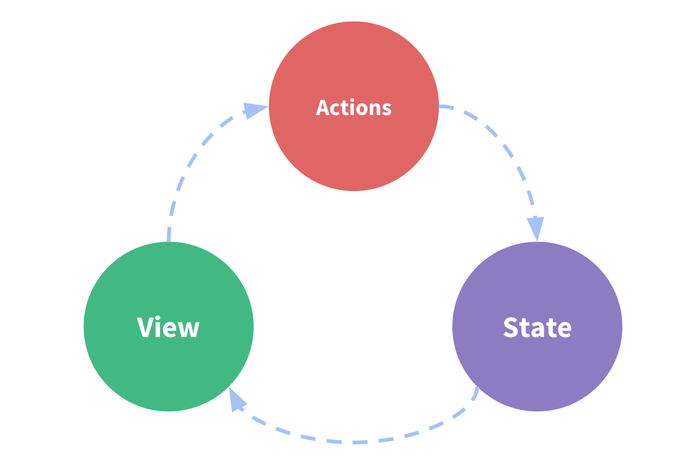

## vuex是什么

Vuex是一个专门为Vue.js应用程序开发的状态管理模式。

它采用集中式存储管理应用的所有组件的状态，并以相应的规则保证状态以一种可预测的方式发生变化。

#### 什么是状态？
状态在这里泛指vue组件的一些当前的状况和性质，例如当前a组件是获取到了10条数据，这是一个状态，b组件滚动到某一个位置，这也是一个状态。

#### 状态管理是什么：
状态管理是对之前说的状态进行管理，例如a组件这个状态需要通知b组件，或者b组件的当前状态需要触发b的父组件的某一个属性。

具体有以下三个内容：

state： 驱动应用的数据源；
view：以声明方式将state映射到视图；
actions：响应在view上的用户输入导致的状态变化；

状态管理的三个内容是怎么使用的呢？就需要先知道vue是单向数据流的方式驱动的，然后三个内容的使用其实是下面这个循环图，**state会显示到view，用户会根据view上的内容进行操作，触发actions然后再去影响state**



正常情况下很好理解和使用，因为都是单向的，非黑即白，但是面对复杂的业务环境之下，单向流方式很容易遭到破坏：

* 多个视图依赖于同一状态。
解决的话需要使用传参方式，但对于多层嵌套的组件将会非常繁琐，并且对于兄弟组件间的状态传递无能为力。
* 来自不同视图的行为需要变更同一状态。
解决的话采用父子组件直接引用或者通过事件来变更和同步状态的多份拷贝。

> 以上的这些模式非常脆弱，主要是因为多个组件之间的关系变得很复杂，通常会导致无法维护代码。

有见及此，vuex借鉴了Flux、Redux、和 The Elm Architecture的设计思想，将状态管理单独抽离出来，形成了现在的vuex。官方也画出了一个图来说明vuex在哪里起作用的，参看下图：


这个图是需要解释一下的:
* vuex的区域是绿色虚线框的位置
* 流程：
    * 每次vue组件需要给vuex分派一个actions，actions提交一个mutation，由mutation来修改state，然后再返回给vue组件渲染。
    * state状态只能有mutation来修改。
    * actions会可以封装各种mutation来进行修改state。
* 关于state: state就是状态
* 关于mutation: mutation是vuex对state或者store提交修改的唯一方式，不用管太多特别的含义。
* 关于getter:
    * 这里没有出现getter, 因为getter在这个流程里面不需要出现，他只是一个属性，方便从vuex的内存里面获取一些信息。
* 关于actions:
    * action 提交的是mutation，而不是直接变更状态。
    * action 可以包含任意异步操作。

> 笔者自己的理解就是action相当于一把手枪，mutation相当于里面的子弹，靶心就是state，得分指示牌就是getter。

#### 什么情况下我应该使用Vuex?
虽然Vuex可以帮助我们管理共享状态，但也附带了更多的概念和框架。这需要对短期和长期效益进行权衡。

* 如果你不打算开发大型单页应用，使用Vuex可能是繁琐冗余的。
* 如果是简单应用一个简单的 global event bus (即做一个全局的变量或者全局对象)就足够您所需了。
* 但是，如果您所需要构建是一个中大型单页应用，您很可能会考虑如何更好地在组件外部管理状态，Vuex将会成为自然而然的选择。

#### 基础样例
* 每一个Vuex应用的核心就是store(仓库)。
* 基本上就是一个容器,它包含着你的应用中大部分的状态(state)。
* Vuex的状态存储是响应式的。当Vue组件从store中读取状态的时候，若store中的状态发生变化，那么相应的组件也会相应得到高效更新。
* 你不能直接改变store中的状态。改变store中的状态的唯一途径就是显示地提交
(commit)mutation。

> 总的来说就是vuex的状态是存储在store里面的，要修改状态就只能进行mutation的提交commit，一旦进行提交成功，状态被改变后，相关使用该状态的组件也会更新状态信息。

```js
// 如果在模块化构建系统中，请确保在开头调用了 Vue.use(Vuex)
const store = new Vuex.Store({
    state: {
        count: 0
    },
    mutations: {
        // 只能通过mutation来进行状态变更
        increment (state) {
            state.count++
        }
    }
})

// 通过vuex 的 mutation 进行 commit
store.commit('increment')

// 通过store.state来获取状态对象
console.log(store.state.count) // -> 1
```

### 什么是Store?
Vuex就是提供一个仓库，Store仓库里面放了很对对象。其中state就是数据源存放地，对应于与一般Vue对象里面的data。

在使用Vuex的时候通常会创建Store实例new Vuex.store({state,getters,mutations,actions})有很多子模块的时候还会使用到modules。


总结，Store类就是存储数据和管理数据方法的仓库，实现方式是将数据和方法以对象形式传入其实例中。要注意一个应用或是项目中只能存在一个Store实例!!

