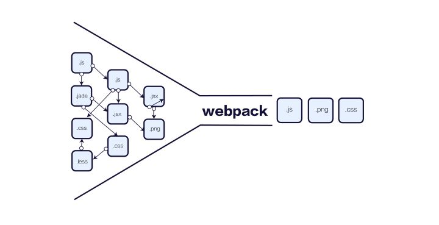
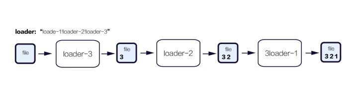

### webpack是什么



webpack是一个模块打包工具，输入为包含依赖关系的模块集，输出为打包合并的前端静态资源。webpack可以将任何前端资源视为模块，如css，图片，文本。

### 为什么要引入新的打包工具

在webpack出现之前，已经有了一些打包工具，如Browserify，那么为什么不优化这些工具，而是重复造轮子?

webpack之前的打包工具功能单一，只能完成特定的任务，然而web前端工程是复杂的，一个webapp对于业务代码的要求可能有：

1. 代码可以分块，实现按需加载

2. 首屏加载时间要尽量减少

3. 需要集成一些第三方库

对于模块打包，单一的支持CommonJs的打包在大型项目中是不够的，为了满足一个大型项目的前端需求，那么一个打包工具应该包含这些功能：

1. 支持多个bundler输出 -> 解决代码分块问题

2. 异步加载 -> 按需加载，优化首屏加载时间

3. 可定制化 -> 可以集成第三方库，可以定制化打包过程

4. 其他资源也可以定义为模块

webpack的出现正式为了解决这些问题，在webpack中，提供了以下这些功能：

1. 代码分块： webpack有两种类型的模块依赖，一种是同步的，一种是异步的。在打包的过程可以将代码输出为代码块（chunk），代码块可以实现按需加载。异步加载的代码块通过分割点（spliting point）来确定。

2. Loaders： Webpack本身只会处理Javascript，为了实现将其他资源也定义为模块，并转化为Javascript，Webpack定义Loaders，不同的loader可以将对应的资源转化为Javascript模块。

3. 智能的模块解析： webpack可以很容易将第三方库转化为模块集成到项目代码中，模块的依赖可以用表达式（这在其他打包工具中是没有支持的），这种模块依赖叫做动态模块依赖。

4. 插件系统： webpack的可定制化在于其插件系统，其本身的很多功能也是通过插件的方式实现，插件系统形成了webpack的生态，可以使用很多开源的第三方插件。

### webpack核心思想

webpack的三个核心：
1. 万物皆模块：在webpack的世界中，除了Javascript，其他任何资源都可以当做模块的方式引用

2. 按需加载： webapp的优化关键在于代码体积，当应用体积增大，实现代码的按需加载是刚需，这也是webpack出现的根本原因

3. 可定制化： 任何一个工具都不可能解决所有问题，提供解决方案才是最可行的，webpack基于可定制化的理念构建，通过插件系统，配置文件，可以实现大型项目的定制需求。

### 配置文件

以命令执行的方式需要填写很长的参数，所以webpack提供了通过配置的方式执行，在项目目录下创建webpack.config.js如下：

```js
var webpack = require('webpack')
module.exports = {
    entry: './src/index.js',
    output: {
        path: './dist/',
        filename: 'index.js'
    }
}
```

执行：

```
$ webpack
```

会和通过命令执行有同样的输出

### webpack配置

#### entry 和 output

webpack的配置中主要的两个配置key是， entry 和 output。

```js
{
    entry: [String | Array | Object], // 入口模块
    output: {
        path: String,        // 输出路径
        filename：String,    // 输出名称 或 名称pattern
        publicPath： String  // 指定静态资源的位置
    }
}
```

#### 单一入口

如果只有一个入口文件，可以有如下几种配置方式

```js
// 第一种
{
    entry: './src/index.js',
    output: {
        path: './dist/',
        filename: 'index.js'
    }
}

// 第二种 Array
{
    entry：['./src/index.js'],
    output: {
        path: './dist/',
        filename: 'index.js'
    }
}

// 第三种 Object
{
    entry：{
        index: './src/index.js'
    },
    output: {
        path: './dist/',
        filename: 'index.js'
    }
}
```

#### 多个入口文件
当存在多个入口文件时，可以使用Array的方式，比如依赖第三方库bootstrap，最终bootstrap会被追加到打包好的index.js中，数组中的最后一个会被export

```js
{
    entry: ['./src/index.js', './verdor/bootstrap.min.js'],
    output: {
        path: './dist',
        filename: 'index.js'
    }
}
```

#### 多个打包目标

上面的例子中都是打包出一个index.js文件，如果项目有多个页面，那么需要打包出多个文件，webpack可以用对象的方式配置多个打包文件

```js
{
    entry: {
        index: './src/index.js',
        a: './src/a.js'
    },
    output: {
        path: './dist/',
        filename: '[name].js'
    }
}
```

最终会打包出：

```
|- a.js
|- index.js
```

文件名称 pattern

* [name]entry对应的名称
* [hash]webpack命令执行结果显示的Hash值
* [chunkhash]chunk的hash

为了让编译的结果名称是唯一的，可以利用hash。

### webpack支持Jsx

现在我们已经可以使用webpack来打包基于CommonJs的Javascript模块了，但是还没法解析JSX语法和Es6语法。下面我们将利用Babel让webpack能够解析Es6和Babel

#### 第一步：npm install 依赖模块

```js
// babel 相关的模块
$ npm install babel-loader babel-preset-es2015 babel-stage-0 babel-preset-react babel-polyfill --save-dev

// react 相关的模块
$ npm install react react-dom --save
```

#### 第二步：webpack.config.js 中添加bael loader配置

```js
{
    entry: {
        index: './src/index.js',
        a: './src/a.js'
    },
    output: {
        path: './dist/',
        filename: '[name].js'
    },
    module: {
        loaders: [
            {
                test: /\.js$/,
                exclude: /node_modules/,
                loader: 'babel',
                query: {
                    presets: ['es2015', 'stage-0', 'react']
                }
            }
        ]
    }
}
```

### webpack loaders

通过loader可以将任意资源转化为JavaScript模块。

Loaders是应用中源码文件的编译转换器，也就是说在webpack中，通过loader可以实现JSX、Es6、CoffeeScript等的转换



#### loader功能

1. loader管道：在同一种类型的源文件上，可以同时执行多个loader，loader的执行方式可以类似管道的方式，管道执行的方式是从右到左的方式。loader可以支持同步和异步。

2. loader可以接收配置参数

3. loader可以通过正则表达式或者文件后缀指定特定类型的源文件

4. 插件可以提供给loader更多功能

5. loader除了做文件转换以外，还可以创建额外的文件

#### loader配置

新增loader可以在webpack.config.js的module.loaders数组中新增一个loader配置。

一个loader的配置为：

```js
{
    // 通过扩展名称和正则表达式来匹配资源文件
    test: String,
    // 匹配到的资源会应用 loader, loader可以为 string 可以为数组
    loader: String | Array
}
```

感叹号和数组可以定义loader管道：

```js
{
    module: {
        loaders: [
            {
                test: /\.jade$/,
                loader: 'jade'
                // .jade文件应用 'jade loader'
            },
            {
                test: /\.css$/,
                loader: 'style!css'
            },
            {
                test: /\.css$/,
                loader: ['style', 'css']
            }
            // .css文件应用 'style'和'css' loader
        ]
    }
}
```

loader可以配置参数

```js
{
    module: {
        loaders: [
            {
                test: /\.png$/,
                loader: 'url-loader?mimetype=image/png'
            },
            {
                test: /\.png$/,
                loader: 'url-loader',
                query: {
                    mimetype: 'image/png'
                }
            }
        ]
    }
}
```

### 使用loader

第一步：安装

loader 和 webpack 一样都是Node.js实现，发布到npm当中，需要使用loader的时候，只需要

```js

$ npm install xx-loader --save-dev

// eg css loader

$ npm install css-loader style-loader --save-dev

```